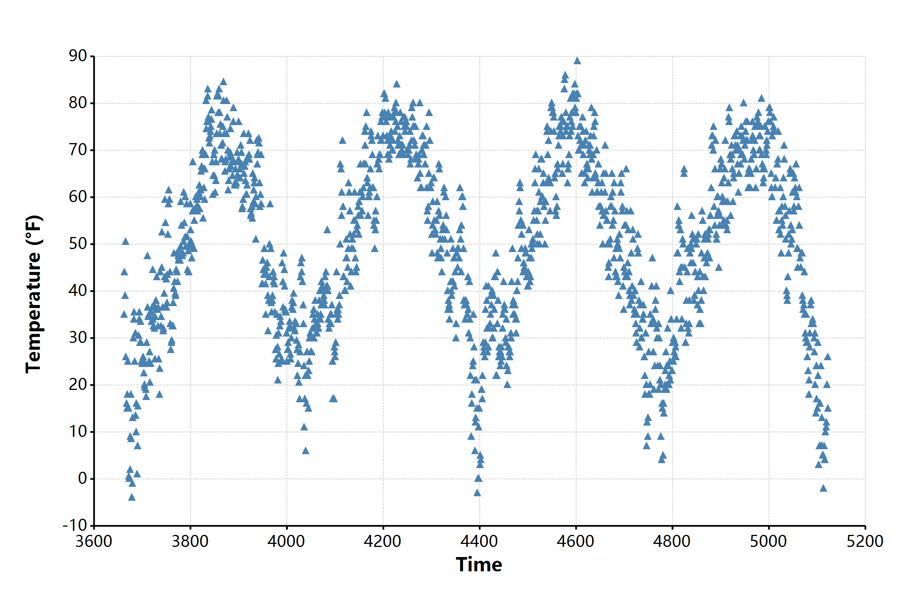

# ggplot
A R language ggplot2 package liked grammar of graphics library for R# language programming

## usage

```r
# loading packages
require(ggplot2);

# read source data
const chic <- read.csv(`${@dir}/chicago-nmmaps.csv`);
# peeks of the raw data
print(head(chic, 10));

#         city      date                   death      temp      dewpoint  pm10             o3           time       season    year
# <mode>  <string>  <<generic> DateTime>   <integer>  <double>  <double>  <string>         <double>     <integer>  <string>  <integer>
# [1, ]   "chic"    #1997-01-01 00:00:00#  137         36        37.5     "13.052268266"    5.6592562   3654       "Winter"  1997
# [2, ]   "chic"    #1997-01-02 00:00:00#  123         45        47.25    "41.948600221"    5.5254167   3655       "Winter"  1997
# [3, ]   "chic"    #1997-01-03 00:00:00#  127         40        38       "27.041750906"    6.2885479   3656       "Winter"  1997
# [4, ]   "chic"    #1997-01-04 00:00:00#  146         51.5      45.5     "25.072572963"    7.537758    3657       "Winter"  1997
# [5, ]   "chic"    #1997-01-05 00:00:00#  102         27        11.25    "15.343120765"    20.7607976  3658       "Winter"  1997
# [6, ]   "chic"    #1997-01-06 00:00:00#  127         17        5.75     "9.36465498"      14.9408742  3659       "Winter"  1997
# [7, ]   "chic"    #1997-01-07 00:00:00#  116         16        7        "20.228427832"    11.9209855  3660       "Winter"  1997
# [8, ]   "chic"    #1997-01-08 00:00:00#  118         19        17.75    "33.1348192868"   8.6784773   3661       "Winter"  1997
# [9, ]   "chic"    #1997-01-09 00:00:00#  148         26        24       "12.118380932"    13.3558919  3662       "Winter"  1997
# [10, ]  "chic"    #1997-01-10 00:00:00#  121         16        5.375    "24.761534146"    10.4482639  3663       "Winter"  1997

bitmap(file = `${@dir}/ggplot-demo.png`, size = [2400, 1600]) {
    # open graphics device and then do plot
    ggplot(chic, aes(x = "time", y = "temp"), padding = "padding:150px 100px 200px 250px;")
       + geom_point(color = "steelblue", shape = "Triangle", size = 21)
       + labs(x = "Time", y = "Temperature (°F)")
       + ggtitle("Temperatures in Chicago")
       + scale_x_continuous(labels = "F0")
       + scale_y_continuous(labels = "F0")
    ;
}
```

