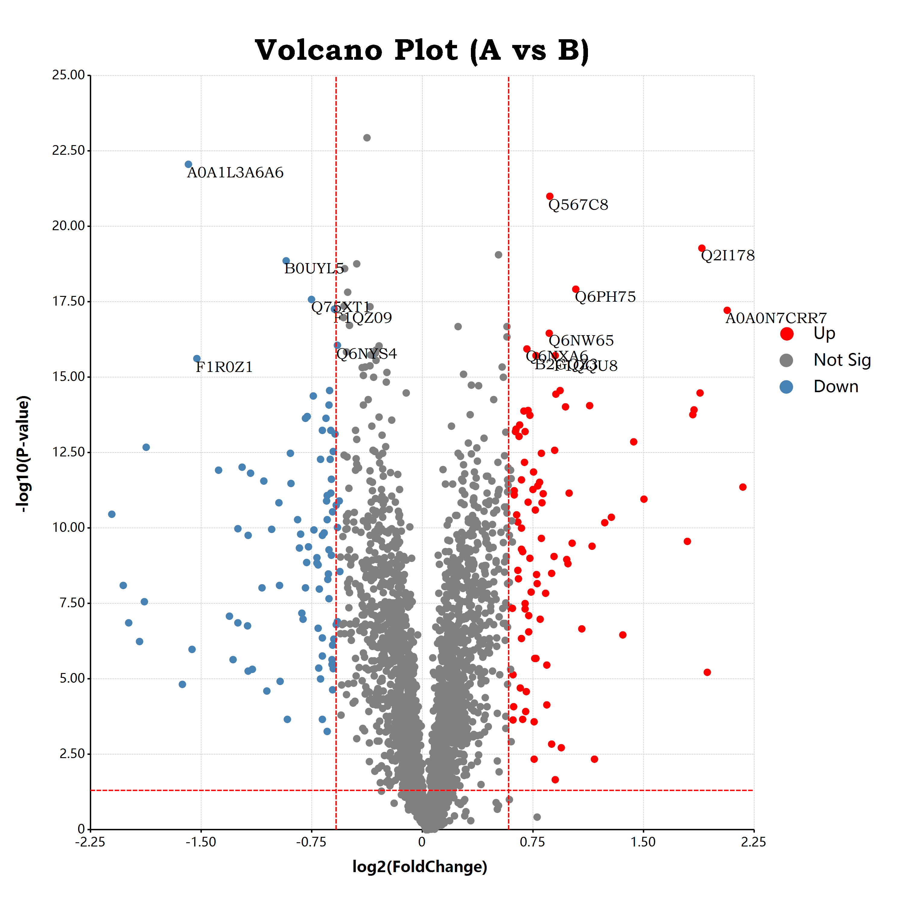

# ggplot
A R language ggplot2 package liked grammar of graphics library for R# language programming

## usage

```r
require(ggplot);

const volcano    = read.csv(`${@dir}/log2FC.csv`);
const foldchange = 1.5;

# create color factor for scatter points
volcano[, "factor"]  = ifelse(volcano[, "log2FC"] >  log2(foldchange), "Up", "Not Sig");
volcano[, "factor"]  = ifelse(volcano[, "log2FC"] < -log2(foldchange), "Down", volcano[, "factor"]);
volcano[, "factor"]  = ifelse(volcano[, "p.value"] < 0.05, volcano[, "factor"], "Not Sig");

# transform of the pvalue scale
volcano[, "p.value"] = -log10(volcano[, "p.value"]);

print("peeks of the raw data:");
print(head(volcano));
print("count of the factors:");
print(`Up:      ${sum("Up"      == volcano[, "factor"])}`);
print(`Not Sig: ${sum("Not Sig" == volcano[, "factor"])}`);
print(`Down:    ${sum("Down"    == volcano[, "factor"])}`);

# [1] "peeks of the raw data:"
#         ID        p.value   log2FC    factor
# <mode>  <string>  <double>  <double>  <string>
# [1, ]   "Q5XJ10"   9.81     -0.205    "Not Sig"
# [2, ]   "A8WG05"   5.21      0.0472   "Not Sig"
# [3, ]   "Q8JH71"   11.6     -0.38     "Not Sig"
# [4, ]   "Q7T3L3"   8.85      0.165    "Not Sig"
# [5, ]   "Q567C8"   21        0.837    "Up"
# [6, ]   "Q92005"   0.091    -0.00514  "Not Sig"
# 
# [1] "count of the factors:"
# [1]     "Up:      90"
# [1]     "Not Sig: 2643"
# [1]     "Down:    93"

bitmap(file = `${@dir}/volcano.png`, size = [3000, 3000]) {

   # create ggplot layers and tweaks via ggplot style options
	ggplot(volcano, aes(x = "log2FC", y = "p.value"), padding = "padding:250px 500px 250px 300px;")
	    + geom_point(aes(color = "factor"), color = "black", shape = "circle", size = 25)
       + scale_colour_manual(values = list(
          Up        = "red",
          "Not Sig" = "gray",
          Down      = "steelblue"
       ))
       + geom_text(aes(label = "ID"), which = ~(factor != "Not Sig") && (p.value >= 15) )
       + geom_hline(yintercept = -log10(0.05),      color = "red", line.width = 5, linetype = "dash")
       + geom_vline(xintercept =  log2(foldchange), color = "red", line.width = 5, linetype = "dash")
       + geom_vline(xintercept = -log2(foldchange), color = "red", line.width = 5, linetype = "dash")
       + labs(x = "log2(FoldChange)", y = "-log10(P-value)")
       + ggtitle("Volcano Plot (A vs B)")
       + scale_x_continuous(labels = "F2")
       + scale_y_continuous(labels = "F2")
	;
}
```



## Plot 3d scatter

rendering a 3d chart in ggplot package is just simply enough as create a 2d chart plot. we just needs add a data mapping of the z axis at here!

```r
# create ggplot layers and tweaks via ggplot style options
ggplot(data, aes(x = "X", y = "Y", z = "Z"), padding = "padding:250px 500px 100px 100px;")
   
   # use scatter points for visual our data
   + geom_point(aes(color = "class"), color = "paper", shape = "triangle", size = 20)   
   + ggtitle("Scatter UMAP 3D")
   # use the default white theme from ggplot
   + theme_default()

   # use a 3d camera to rotate the charting plot 
   # and adjust view distance
   + view_camera(angle = [31.5,65,125], fov = 100000)
   ;
```


### Theme in ggplot

just change the function ``theme_default`` to ``theme_black``, then we can get a cool 3d scatter plot in black theme:

```r
ggplot(data, aes(x = "X", y = "Y", z = "Z"), padding = "padding:250px 500px 100px 100px;")
   
   + geom_point(aes(color = "class"), color = "paper", shape = "triangle", size = 20)   
   + ggtitle("Scatter UMAP 3D")
   # use the black theme from ggplot package
   + theme_black()
   + view_camera(angle = [31.5,65,125], fov = 100000)
   ;
```

